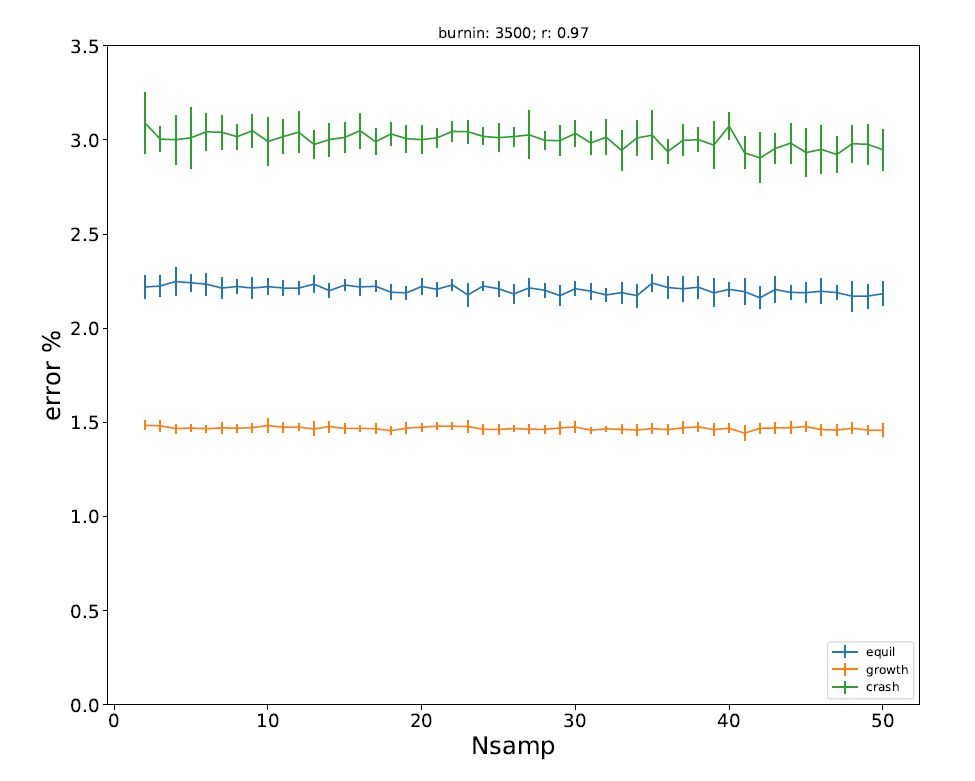

## Demography and phasing

A simple test of the impact of demographic history on phasing approaches.

We use the software beagle v5.1 to phase simulated genotype data.

Simulations consist of 1MB genomic regions generated using the software SLiM v3.

Three simple demographic scenarios are explored:

- population crash : a population suffers an exponential crash of rate 0.97, from Ne = 20e3 to 10e3;

- population growth : a population undergoes exponential growth of rate 1.03, from Ne = 20e3 to 40e3;

- Equilibrium : A population of effective size 20e3 undergoes no demographic changes.

In all three cases populations evolve neutrally for 35 thousand burn-in generations. Demographic changes are operated following burn-in, and genotypes are sampled at generation time 40k. 

Results:

We find that demography has a clear impact on phasing. This impact is correlated with the diversity of these populations, as it is affected by demography. We hypothesise that this result will be replicated in other phasing approaches. 

Conclusions: Algorithmic phasing should take demographic history in consideration. 

