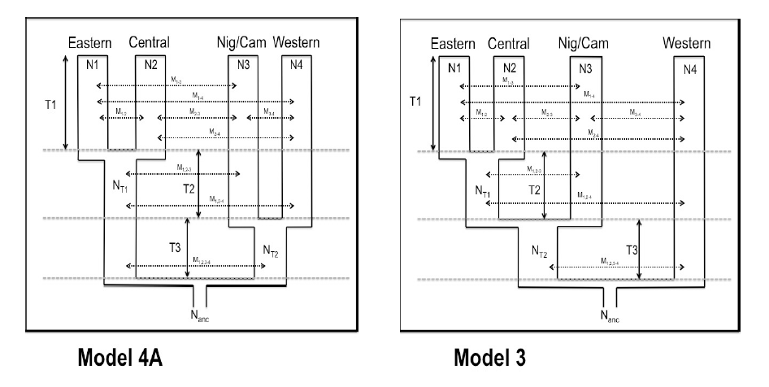

## ABC simulations.

This repository resulted from the need to generate simulations that sample from the posterior probabilities of a published model, generated using an ABC approach. 

The procedure proposed here does not deal in continuous population size changes in time. We mean to simulate simple models, where branch size is kept constant. 

Specifically, the following topologies, obtained from the supplementary material of Prado & Martinez 2013.

These images were succintly summarized by the authors in the tables.

These tables provde summary statistics relating to every factor in the topology:
    - Time of each node.
    - Size of each branch.
    - Pairwise migration.

From this table, with only slight modifications, we developped scripts to produce viable SLiM recipes. 

visit the notebook for more details: [notebook](https://nbviewer.jupyter.org/github/SantosJGND/SLiM/blob/master/demos_ABC/demos_utilities.ipynb)